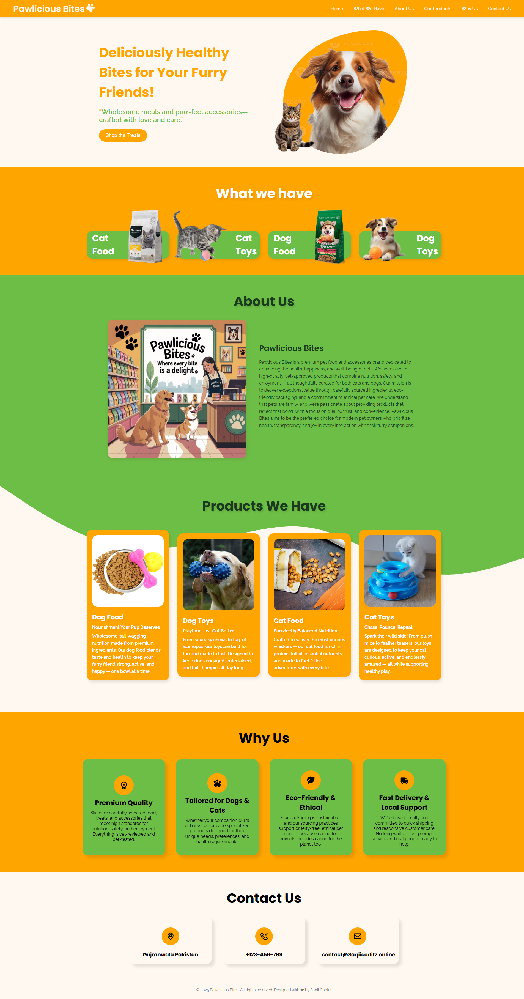

# 🐾 Pawlicious Bites – Pet Food & Accessories Store


> **Live Site:** [pawlicious.saqiicoditz.online](https://pawlicious.saqiicoditz.online)

---

## 🛍️ Overview

**Pawlicious Bites** is a responsive and stylish website for showcasing pet food and toys for dogs and cats. Built for performance and charm, it's ideal for small pet businesses looking to establish a playful, professional online presence.

---

## 📁 Folder Structure

```bash
|-- .cpanel.yml                   # Deployment config for cPanel
|-- index.html                    # Homepage
|-- README.md                     # Project documentation
|-- assets/
|   |-- css/
|   |   |-- styles.css            # CSS files
|   |-- favicons/                 # Icons and manifest
|   |-- img/                      # Product & design images
|   |-- js/                       # JavaScript Files
````

---

## 🎨 Color Palette

| Color        | Hex       | Role                  |
| ------------ | --------- | --------------------- |
| Fresh Green  | `#6DBE45` | Hero, waves, accents  |
| Orange/Peach | `#FFA500` | Buttons, card BG      |
| White        | `#FFFFFF` | Text and backgrounds  |
| Soft Pink    | `#FFC0CB` | Highlights (optional) |

---

## 🔧 Tech Used

* ✅ **HTML5**
* ✅ **CSS3 (Flexbox, Variables, Shadows)**
* ✅ **JavaScript** – for basic interactivity
* ✅ **Font Awesome / Custom Icons**
* ✅ **Google Fonts**
* ✅ **Responsive Media Queries**

---

## 🖥️ Pages & Sections

* ✅ Hero Section – Headline, CTA
* ✅ Product Showcase – Food & Toys for Cats and Dogs
* ✅ About Us – Brand intro and mission
* ✅ Why Us – Trust-building benefits with icons


---

## 🌟 Features

* Fully mobile responsive
* Clean UI/UX with warm colors
* Smooth hover & scaling effects
* SEO-optimized structure
* Preloaded favicons and manifest for PWA readiness

---

## 📸 Preview



---

## ⚙️ Deployment

This site is deployed using **cPanel**. 
---

## 📬 Contact

* 💼 [saqiicoditz.online](https://saqiicoditz.online)
* 📧 Email: [saqiicoditz@gmail.com](mailto:contact@saqiicoditz.online)
* 📷 Instagram: [@saqiicoditz](https://instagram.com/saqiicoditz)

---

## 📝 License

Licensed under the **MIT License** — free to use, edit, and distribute for personal and commercial use (with credit).


